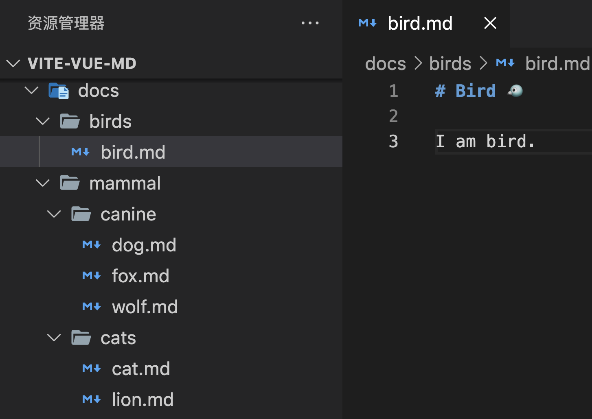
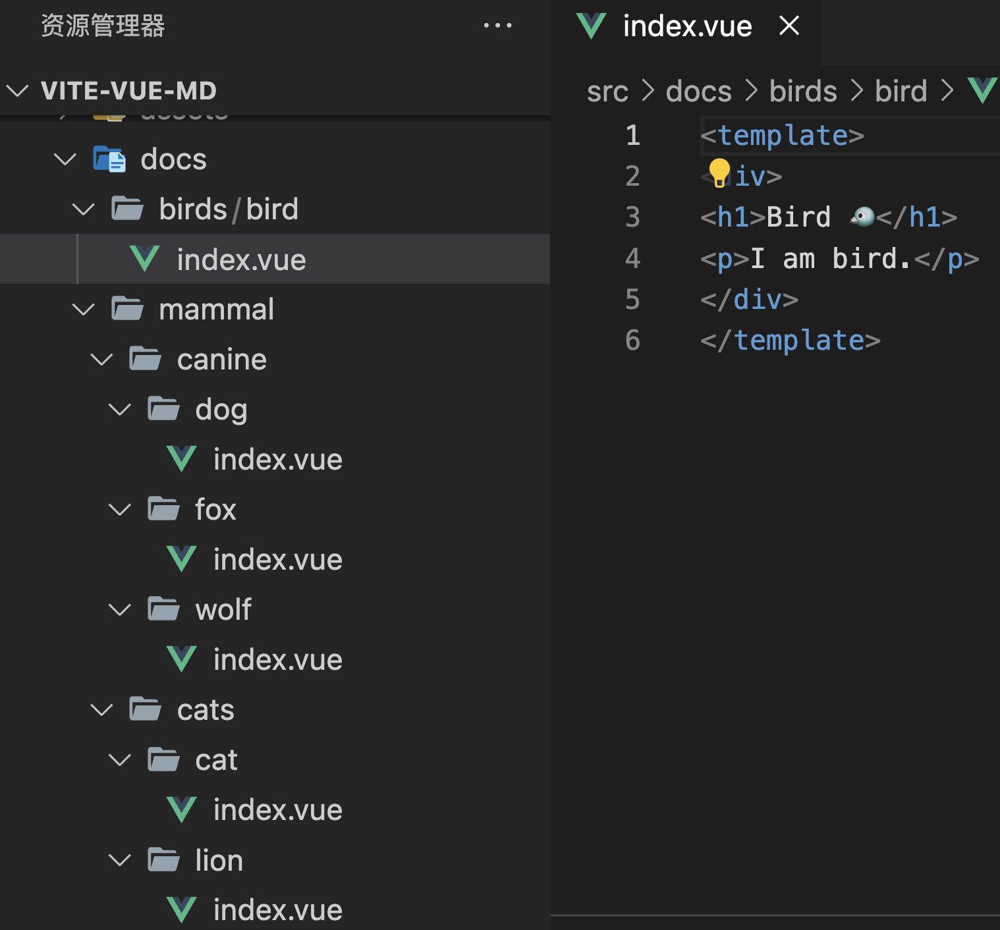

# 一个需求引发的学习之 Vite 插件开发

## 引

Markdown 文件是一种受程序员群体喜爱的文本格式，通常用在笔记等场景，进而自然而然催生了诸多例如 hexo、vuepress、vitepress  等博客网站框架。

但很多时候，上述这些博客框架并不能满足我们的对博客的需求，复杂的需求在既有的博客框架约束下不能或很难实现。

将这类支持 Markdown 的博客网站框架能力抽象一下，发现主要有以下两点：

1. 将 Markdown 文件转译为底层框架可接受的组件；
2. 根据 Markdown 文件所在目录生成底层框架可接受的路由文件；

这两点需求并非需要博客网站框架如此重的实现，也可以以 Webpack、Vite 等模块打包工具的 plugin 形式实现。

下文将实现一个具备上述两点功能的 Vite plugin，同时借此机会学习 Vite plugin 的开发。

出于代码理解难易程度的考量，开发该插件时假定底层框架为 Vue，并对文中出现的代码做了一定功能的阉割。详细代码可见 GitHub 仓库。

## 使用方式与实现效果

### 使用方式

```js
// vite.config.js
import { defineConfig } from 'vite';
import md2components from './vite-plugin-md2components';

export default defineConfig({
  plugins: [md2components()],
});

// 可配置的使用方式
export default defineConfig({
  plugins: [md2components({
    rootDir: 'docs', // 指定 md 文件所在文件目录
    routeFilePath: 'src/router/md.ts', // 指定生成的路由文件路径
    componentsDir: 'src/docs', // 指定生成的组件文件目录
  })],
});
```

### 实现效果

当项目冷启动或热更新时：

1. 生成路由文件 
2. 生成组件

## 核心功能实现

### Vite plugin 格式

首先，Vite 是基于 Rollup 的，并且沿用了 Rollup 的插件系统，在此之上有特定开发

Vite plugin 本身是一个对象，参考 https://vitejs.dev/guide/api-plugin.html

在该对象的诸多属性中，部分属性我们称之为 hook，每个 hook 都是一个函数，这些 hook 在不同的时机会被触发。

例如：options 与 buildStart 会在服务器启动前触发，handleHotUpdate 会在文件热更新时触发。

我们希望在项目冷启动和热更新的时候，都会执行 genComponents 与 genRoutes，故本插件需要用到 buildStart 与 handleHotUpdate 两个 hook。此时，该 plugin 对象应为：

```js
const run = () => {};

const plugin = {
  buildStart: async () => {
    await run();
  },
  handleHotUpdate: async (ctx) => {
    await run();
  },
};
```

初见雏形。加下来，我们将在 run 函数中实现 3 个功能：

1. 获取指定目录下所有的 md 格式文件
2. 根据 1 获取到的文件，生成路由文件（下文称 genRoutes）
2. 根据 1 获取到的文件，生成组件（下文称 genComponents）

```js
// 获取指定目录下所有的 md 格式文件
const getFiles()=>{};
// 根据 md 文件信息，在指定目录生成路由文件
const genRoutes(files, routeFilePath)=>{};
// 根据 md 文件信息，在指定目录生成组件
const genComponents(files, componentsDir)=>{};

const run = () => {
  const files = await getFiles(rootDir);
  await Promise.all([
    genRoutes(files, routeFilePath),
    genComponents(files, componentsDir)
  ])
};
```

### 获取指定目录下所有的 md 格式文件

使用 node 的 fs.readdir 与 fs.stat API，广度遍历该文件夹，过滤出所需文件。

该功能较为简单，非核心内容，详细代码移步仓库。

### genComponents

将 md 格式文件转为 html，有诸多第三方库可以实现该功能。其中，markdown-it 库社区活跃，功能全面质量稳定，被很多项目例如 vuepress 选择。本项目也将选择该库。

该功能的具体步骤为：

```js
// 读取 md 文件
const mdString = await fs.readFile(file, 'utf8');
// 使用 markdown-it 将 md 文件转换为 html 字符串
const htmlString = mdit().render(mdString);

// 将 html 字符串包裹为 vue 字符串
const content = `<template>\n<div>\n${htmlString}</div>\n</template>`;
// 将 vue 字符串写入 vue 文件
await wf(`${componentsDir}/${path}/${name}.vue`, content);
```

### genRoutes

该功能的具体步骤为：

```js
// 根据 md 文件信息，生成 vue route 的字符串
const routes = files.map((file) => {
    const parts = file.split(/\/|\./).slice(1, -1);
    const path = parts.join('/');
    const name = parts[parts.length - 1];
    return `{ path: '/${path}', name: '${parts.join(
      '.'
    )}', component: () => import('/src/docs/${path}/${name}.vue')}`;
  });

// 包裹生成的 vue route 的字符串数组为 JS 代码字符串
const content = `export default [\n${routes.join(',\n')}\n]`;
// 将 JS 代码字符串 写入 JS 文件
await wf(targetFile, content);
```

至此，核心功能全部实现。

## 功能优化

该插件在实现核心功能的基础上，实现了诸多提升使用者开发体验的能力。如：

1. 当且仅当指定目录的 md 文件变更时，重新执行本插件功能

   ```js
   // 当前项目的绝对地址
   const pwd = process.cwd();
   // handleHotUpdate 为热更新 hook
   handleHotUpdate: async (ctx) => {
     // ctx.file 为变更文件
     if (ctx.file.includes(`${pwd}/${rootDir}`)) {
       await run(options);
       }
   }
   ```

2. 以函数的的形式返回 plugin 对象，以提供可供使用者配置的参数

   ```js
   export default ({
       rootDir: 'docs',
       routeFilePath: 'src/router/md.ts',
       componentsDir: 'src/docs',
     }
   ))=>{
     const plugin = {
       // ...
     };
     return plugin;
   }
   ```


后期，该插件将作为一个开源项目，进行长期更新与维护。

后续文章将更新，以该插件为基础，进行的工程化与 npm 包发布。